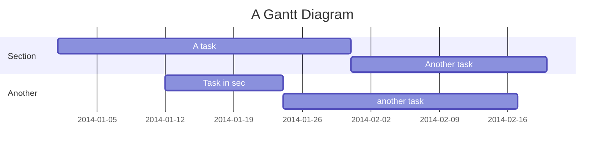
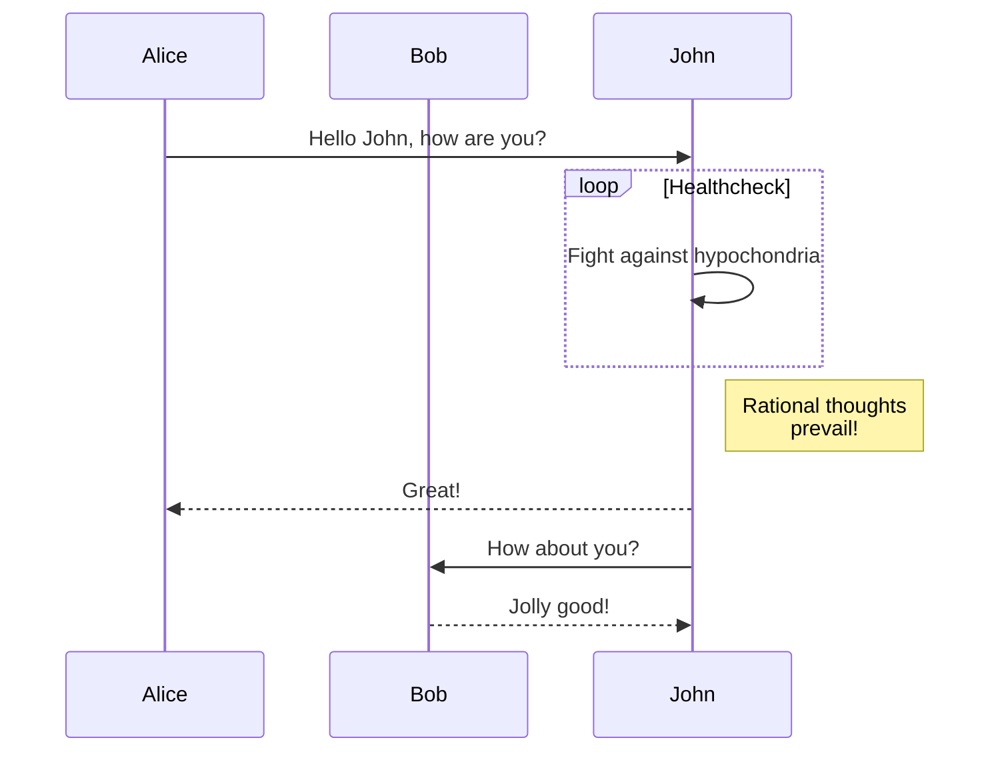
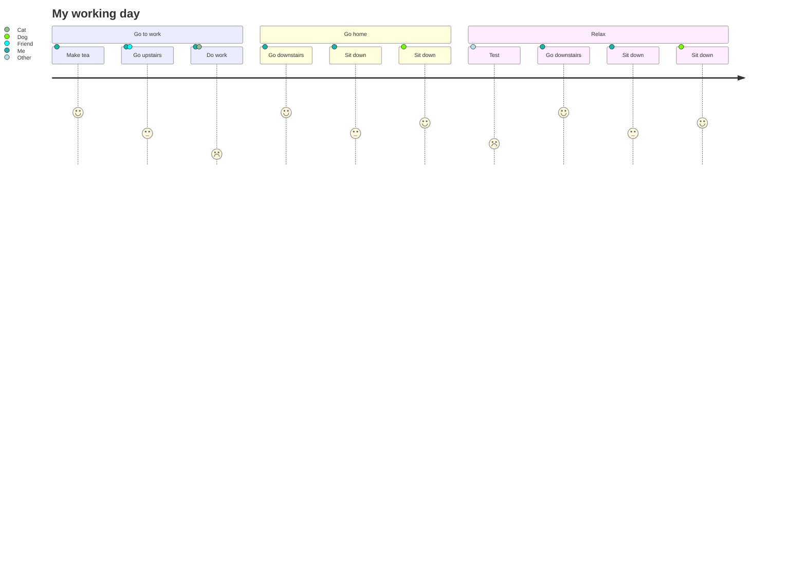

```mermaid
gantt
    title A Gantt Diagram
    dateFormat  YYYY-MM-DD
    section Section
    A task           :a1, 2014-01-01, 30d
    Another task     :after a1  , 20d
    section Another
    Task in sec      :2014-01-12  , 12d
    another task      : 24d
```    

## Inform

```mermaid
sequenceDiagram
    participant Alice
    participant Bob
    Alice->>John: Hello John, how are you?
    loop Healthcheck
        John->>John: Fight against hypochondria
    end
    Note right of John: Rational thoughts <br/>prevail!
    John-->>Alice: Great!
    John->>Bob: How about you?
    Bob-->>John: Jolly good!
```    

## Inform

```mermaid

journey
    title My working day
    section Go to work
      Make tea: 5: Me
      Go upstairs: 3: Me, Friend
      Do work: 1: Me, Cat
    section Go home
      Go downstairs: 5: Me
      Sit down: 3: Me
      Sit down: 4: Dog
    section Relax
      Test: 2: Other
      Go downstairs: 5: Me
      Sit down: 3: Me
      Sit down: 4: Dog
    
      
```
